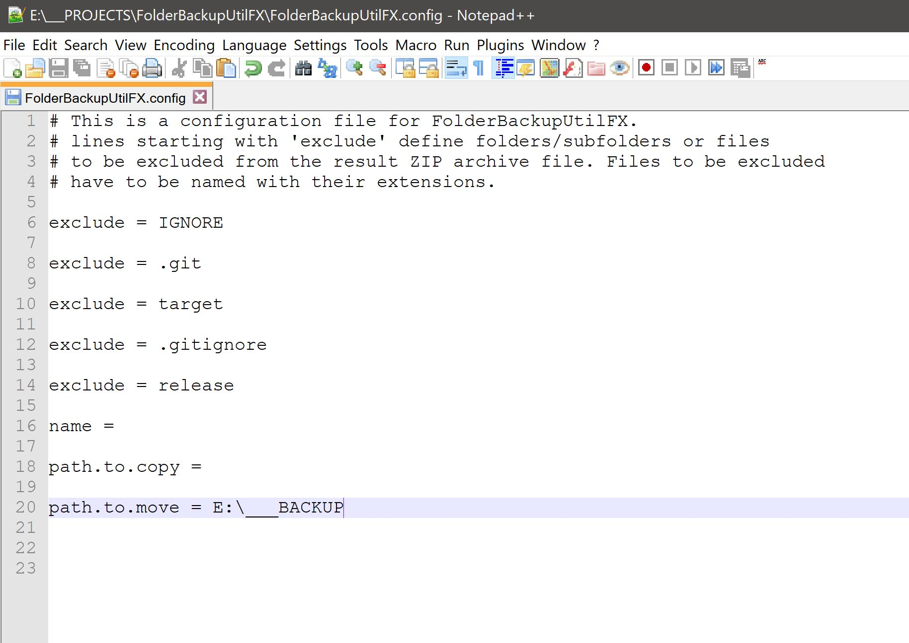
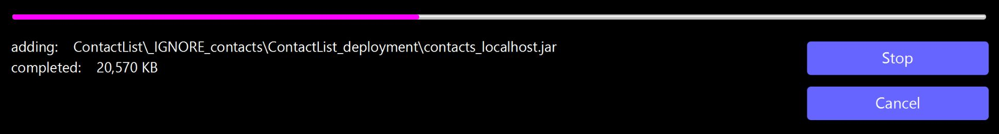
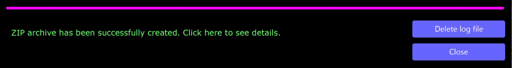
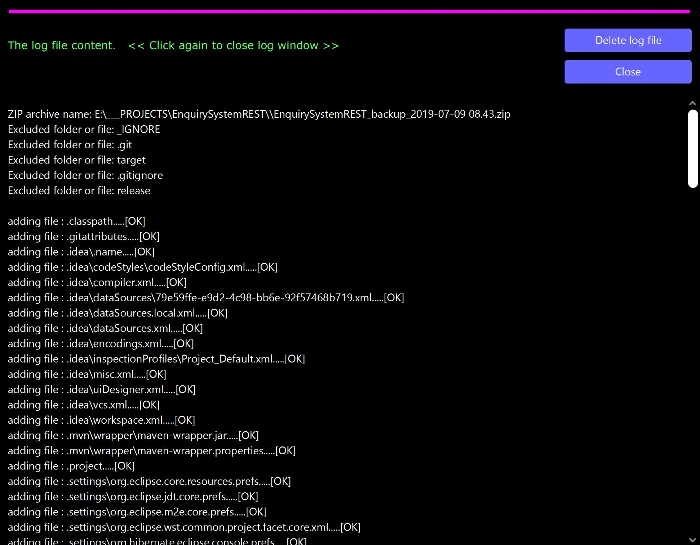

# Folder Backup Util FX

A tool for compressing files and folders to ZIP format with a simple JavaFX GUI.  
  
# General Info

FolderBackupUtilFX packs the content of the folder it is executed from
(files, folders and subfolders) into a ZIP file. You can exclude
 files and folders listing them in the  `FolderBackupUtilFX.config` file (which 
if exists is read at the application start). The `.config` file contains explanations 
how to use it.

When started the app will begin compressing the all folders, subfolders and files in the root folder showing
a progress bar in the main window. At any point the process can be stopped. When finished, cancelled or interrupted otherwise an option to delete the created ZIP archive will be shown as well as an option to close the app.
    
The content of the result  ZIP file includes (unless excluded explicitly in `FolderBackupUtilFX.config`) `FolderBackupToolFX_vXX.log` and `FolderBackupUtilFX.config` files.   
    
By default the ZIP file name is composed of: `folder name` + `_backup_` + `date and time` + `.zip` 
(eg. `FolderBackupUtilFX_backup_2019-07-01 10.51.zip`) unless configured otherwise in the `.config` file.

A `.log` file with the `.config` options and a list of all the archived files is created under the same name as the main archive but with `.log` extension.

Default location of the created archive is in the folder being archived.

### Config file options (`FolderBackupUtilFX.config`)

- `exclude = ` - folders and files to exclude, one line one folder/file
- `name = ` - a name for the archive to create
- `path.to.copy = ` - a path to copy the created archive to
- `path.to.move = ` - a path to move the created file to

If an option is left blank the app falls back to default settings. The same happens if there is no `FolderBackupUtilFX.config` file.

### *side note*
*Created it for myself - the idea being that when you have a folder based project you working frequiently on and want 
to have a quick extra backup at the end of a day, you drop this app in said folder, configure it once and run it.* 

# Screenshots

  

   

  

   

	 

   

	

    
 

	

# Status

Minor improvements and bux fixing only.

# Technologies
- Java JDK 8
- JavaFX 8
- Maven 3.60
- IntelliJ IDEA
- Scene Builder

**Plugins and libraries**
- Apache Shade Maven plugin  version 2.4.1
- Launch4j version 1.7.25
- Apache CommonsIO version 2.6

# License
FolderBackupUtilFX is free software: you can redistribute it and/or modify it under the terms of the GNU General Public License 
as published by the Free Software Foundation, either version 3 of the License, or (at your option) any later version.
FolderBackupUtilFX is distributed in the hope that it will be useful, but WITHOUT ANY WARRANTY; without even the implied 
warranty of  MERCHANTABILITY or FITNESS FOR A PARTICULAR PURPOSE.  See the GNU General Public License for more details.
You should have received a copy of the GNU General Public License along with FolderBackupUtilFX. 
If not, see http://www.gnu.org/licenses/ or write to: latidude99@gmail.com

# Contact
You can email me at latidude99@gmail.com

